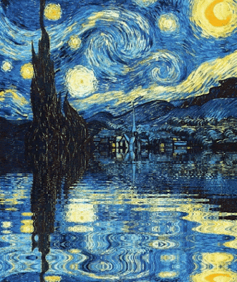

<em>Computer Engineering student at <a href="https://portal.pcs.ifsuldeminas.edu.br/">Instituto Federal Sul de Minas</a>  ReactJS Developer Jr. at <a href="https://arecreativa.com.br/">A Recreativa</a>

<h4>😊 My favorite languages & frameworks!</h4>

